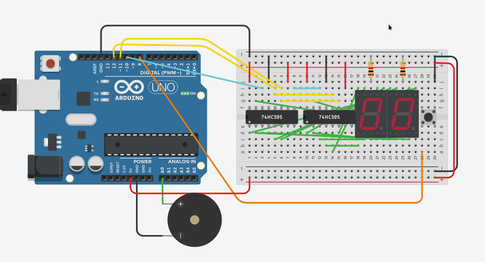

# Robot ika - 1 ND
Projektas yra (netikras, žaislinis) detonatorius. Gavęs mygtuko paspaudimą, detonatorius 8 segmentų ekranuose rodo skaičius nuo 10 iki 0, ir tada pradeda pypsėti. Kolonėlei pypsint, ekranuose mirksi skaičius 0.

Yra 2 projekto variantai:
- padarytas tik naudojant arduino (sunaudojant visus digital pinus, ir 2 analog pinus)
- padarytas naudojant du 74HC595 shift registrus (sunaudoja tik 4 digital pinus ir 1 analog piną)

Skaitmenys rodymui ekrane yra saugomi 8 bitų skaičiuose:

```c
const byte states[11] = {
    191, 134, 219, 207, 230,
    237, 253, 135, 255, 239,
    0
};
```

Tokiu būdu galima lengvai gauti segmento būseną (on/off), kai reikia parodyti atitinkamą skaičių. 

```c
states[skaitmuo] & (1 << segmentas);
```

Šią pačią procedūrą savaime atlieka ir shift registras, todėl buvo labai paprasta konvertuoti kodą shift registrams.

## Panaudotos dalys (2 var.)
- Arduino UNO
- Du 8 segmentų ekranai
- Mygtukas
- Du 74HC595 shift registrai
- Du 220 Ohm rezistoriai
- Garsiakalbis
- Laidai



## Ateities patobulinimai - tikros bombos pajungimas
Galima būtų prijungti ir tranzistorių (NPN, su pull down resistorium), kuris galėtų valdyti didesnę srovę. Tokiu būdu galima užkaitinti vielą (nežinau kaip veikia tikri detonatoriai).
